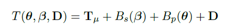
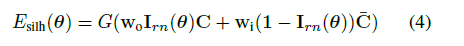
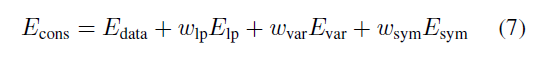

## 第一篇论文初步阅读报告
>   该实验采用基于CNN的视频分割方法，每个序列进行3-4次人工分割训练。
> 该方法结合了两个算法。
> * 一个是根据表面位移来细化参数化的人体模型。
> * 另一个是一种新的方法，即在一个共同的参照系中对动态人体轮廓锥进行变形和融合。融合锥融合了视频中包含的形状信息，让我们能够经过优化得到详细的模型形状。该算法不仅能捕捉到人脸的几何形状和外观，还能自动地获得运动学骨架的人体模型，从而实现与姿势有关的近似的表面变形。
### 1. SMPL模型改进：增加补偿项 
SMPL模型输入是10种身形参数（β，包含人的高矮胖瘦和头身比）和72种姿态参数（θ，包含运动位姿以及24个关节相对角度）。输出是N=6890个顶点的triangulated mesh。

**T**：身形和姿态的变形。

**W**：一个混合蒙皮（blend-skinning）线性方程，其包含：
+ 骨骼关节J(β)
+ 与姿态有关的变形Bp(θ)
+ 与身形有关的变形Bs(β)

因为SMPL是裸的人体模型，而该实验最后的目标并不是一个裸露的人的模型，而是包含衣服，头发甚至纹理，所以在T的表达式中加了一个补偿项D, **该项会在第二步得到优化**:

 

### 2. 姿态重建(Pose Reconstruction) 
计算每个帧的3D姿势。输出是成序列的F帧的一个pose集合。

**为了避免尺度模糊（scale ambiguity），每次计算时只考虑5帧，即一个身形的五个姿势。**

首先，以SMPL模型的身形参数β0为固定的初始化值，为了更精确，计算时引入轮廓项。为进一步获得极小值，在高斯金字塔G的四个层次上进行了优化。

 

接下来使用二维关节检测和以SMPL中单模态的A姿态先验的方法来计算其姿势。用SMPL中pose参数的来训练这个prior。即进行一系列的迭代，第一帧的初始化值就是SMPL中的A姿态，而在预估新的一帧中的姿态时，初始化值是上一帧的最终预估值。如果误差过大则将pose参数重新初始化为0。除此以外，该试验方法的创新点是在计算时引入轮廓项，并在高斯金字塔的四个层次上进行了优化。最终得到的结果是一段时间内的一系列姿态。

### 3. 共识身形估计(Consensus Shape Estimation) 
对于上一步得到的一系列姿势，从中分批给定一组估计的姿势，可以用它们联合优化单个精确的身形来匹配所有原始的姿势。因为在每一帧人的轮廓都会给身形带来新的限制，具体来说，从相机到轮廓点的光线集合定义了一个约束锥。该实验就是将顶点v的变形函数（SMPL函数）进行逆变换运用到轮廓锥的每一条光线r中。对于每一条射线r，都能找到它最近的3D模型点。对模型点对应的射线r进行逆变换。这样就能有效地消除轮廓锥，并对标准T形的身形设置约束，每一批次训练120个轮廓，经过计算得到的光线形成了一个规范的T型模型。这一步骤叫做**unposing**, 它使得身体形状得到有效优化并独立于姿态。 

具体地，该实验构建了一个能量式，即1个数据能量和3个正则化能量的线性组合。

+ 第一项: 轮廓项，测量边界点和轮廓线之间的距离

+ 第二项：拉普拉斯项（用来保证形变的平滑性）
+ 第三项：身体模型项（进行偏差处罚，即误差消减）
+ 第四项：对称项（约束用来保证形体的对称性）。通过身形参数β以及补偿项D的改变可以使得整个式子的值达到最小从而得到精确的身形。 

 

### 4. 帧细化和纹理的映射生成(frame refinement and texture map generation) 

在计算了给定序列帧的全局形状后，接下来的目标是捕获时间变化。

将第二步的能量式修改后按照顺序来处理一系列帧。具体是用前一帧计算
所得来。

初始化优化，并与相邻帧进行正则化优化。为了创建纹理，将估计的规范模型返回到每个帧，将图像颜色向后投影到所有可见顶点，最后通过计算所有视图中最正交的纹理的中值生成纹理图像。
